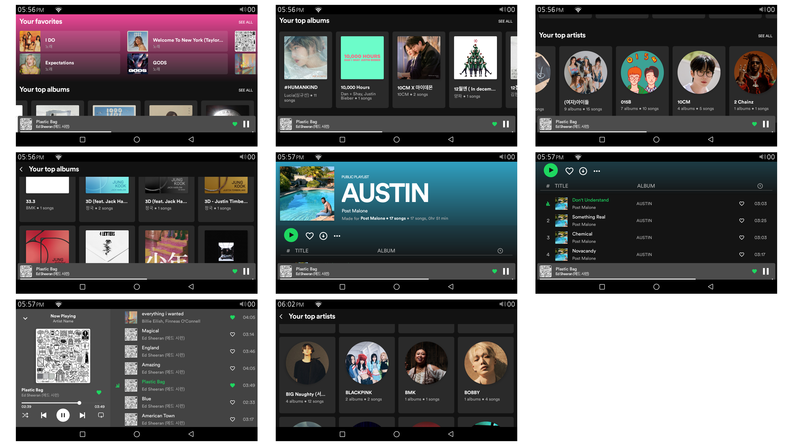

# Spotify Compose Demo App
- mobile: Spotify 모바일 앱 클론, Fake Player
- app: USB 스토리지 기반 뮤직 플레이어 앱

# 기능
- Jetpack Compose로 UI 구성
- Clean Architecture
- MVI 패턴
- USB 스토리지에 있는 음악 파일들 MediaMetadataRetriever를 통해 Room DB에 저장
- 음악 파일의 Album Art, Artist Picture Spotify API를 통해 가져오기
- Coil 라이브러리로 이미지 로딩
- Track, Album, Artist의 favorite 기능
- Favorite, Album, Artist 별 카테고리
- ExoPlayer 라이브러리로 음악 재생
- BottomSheetScaffold로 플레이어 화면 구성

# Caution

- Spotify API를 사용하기 위해서는 Spotify Developer 계정이 필요.
- Spotify Developer Dashboard에서 앱을 등록하고 Client ID, Client Secret을 발급.
- 발급받은 Client ID, Client Secret을 local.properties에 저장.
- local.properties 파일에 다음과 같이 추가.
```
spotify.id="your_client_id"
spotify.secret="your_client_secret"
```

# 화면 캡처

## mobile


## ivi


