# Spotify Compose Demo App
- USB 스토리지 기반 뮤직 플레이어 앱

# 기능
- Jetpack Compose로 UI 구성
- Clean Architecture
- MVI 패턴
- USB 스토리지에 있는 음악 파일들 MediaMetadataRetriever를 통해 Room DB에 저장
- 음악 파일의 Album Art, Artist Picture Spotify API를 통해 가져오기
- Coil 라이브러리로 이미지 로딩
- Track, Album, Artist의 favorite 기능
- Favorite, Album, Artist 별 카테고리
- ExoPlayer 라이브러리로 음악 재생
- BottomSheetScaffold로 플레이어 화면 구성

# 화면 캡처

## mobile

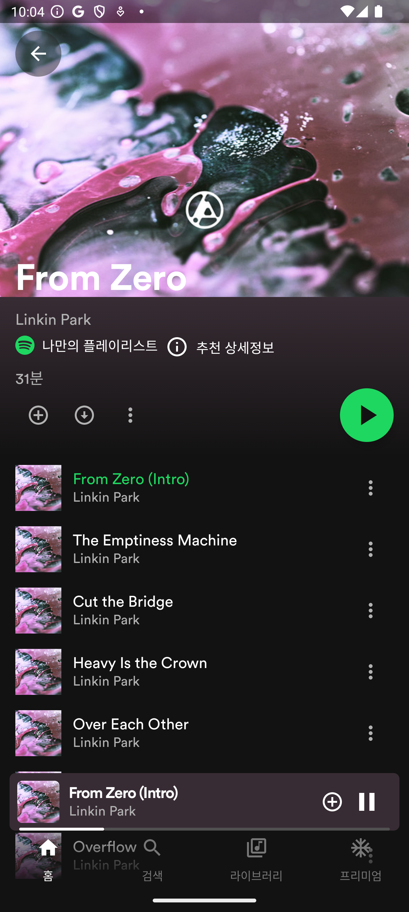
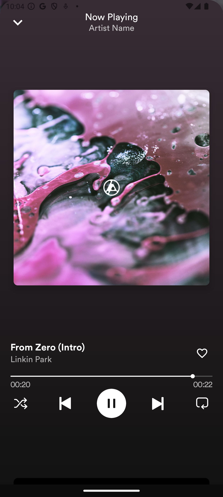
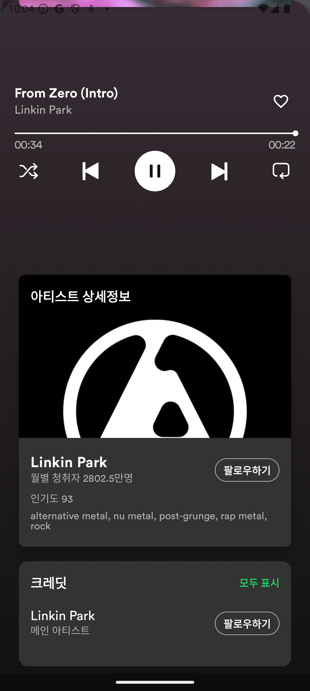

## ivi

### 메인 화면 (Home)
- Favorite 카테고리
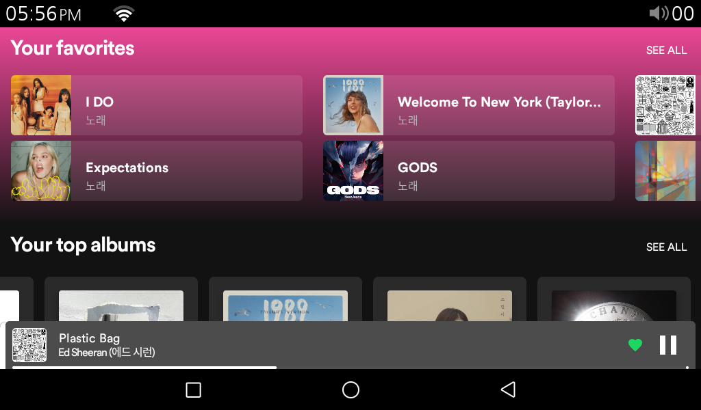

- Album 카테고리
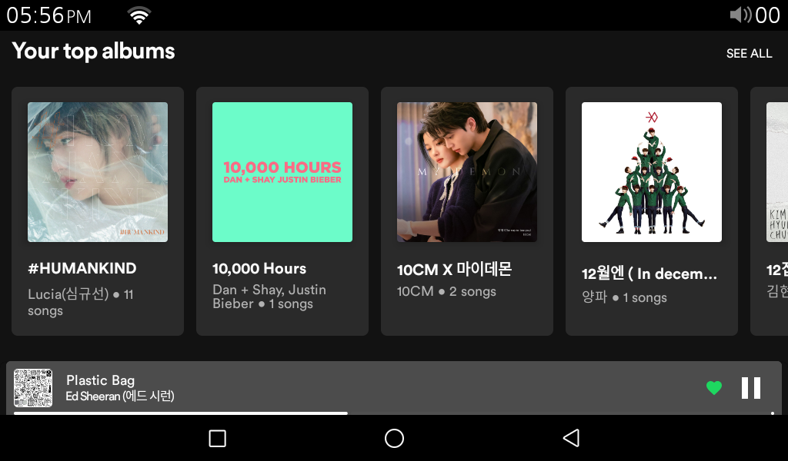

- Artist 카테고리
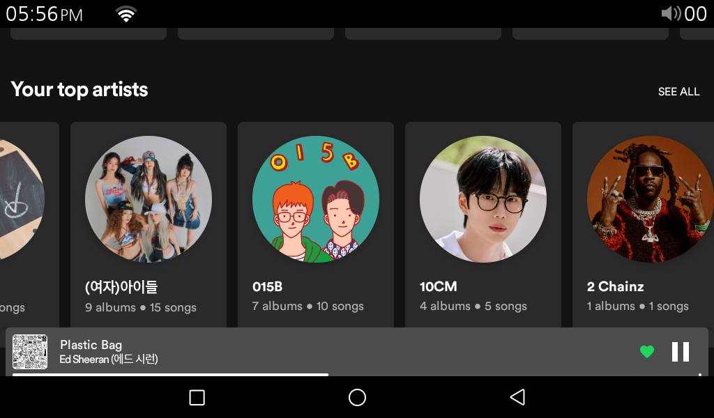

### 모두 보기 화면 (Grid)
- Album 모두 보기
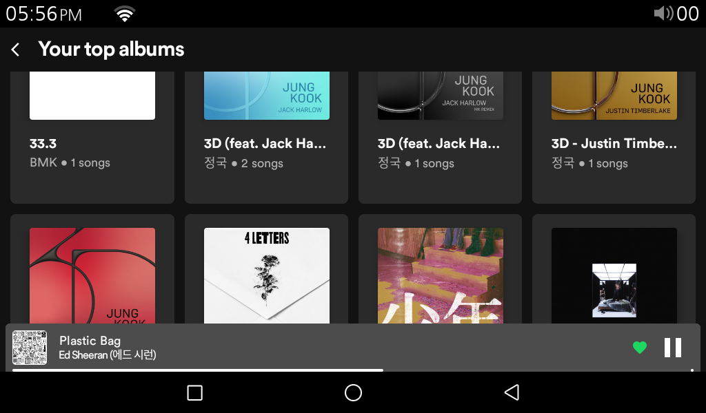

- Artist 모두 보기
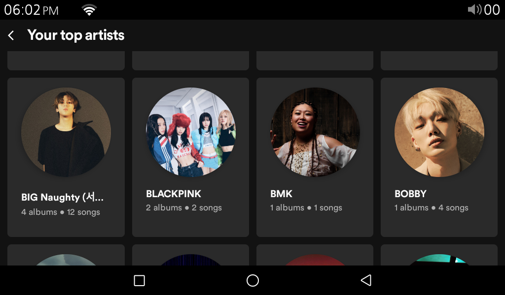

### 앨범 상세 화면 (List)
- 앨범 커버
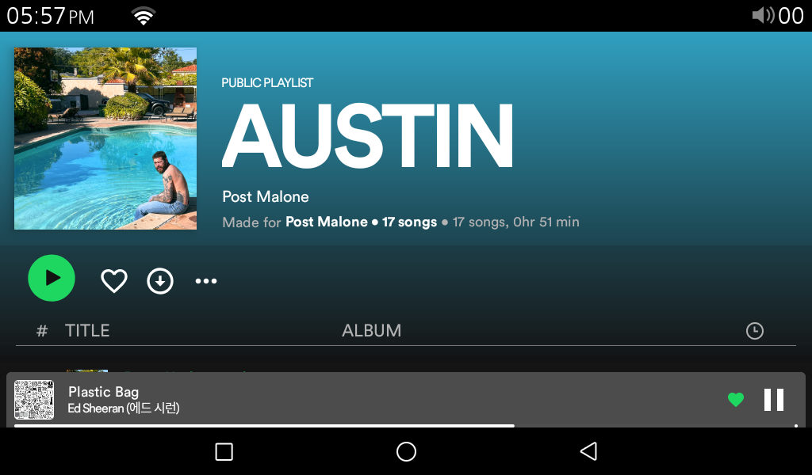

- 앨범 트랙 리스트
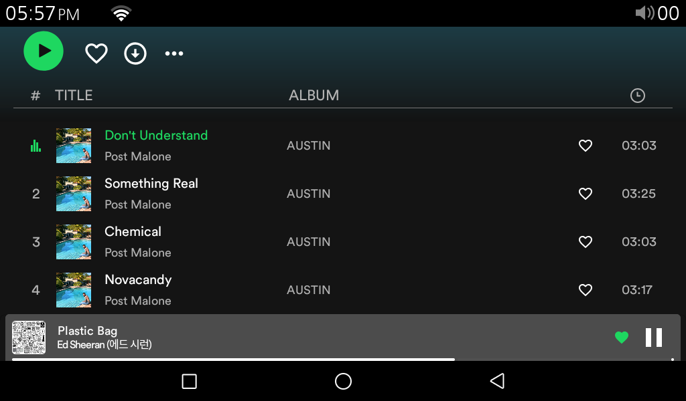

### 플레이어 화면 (BottomSheetScaffold)
-  expanded 상태
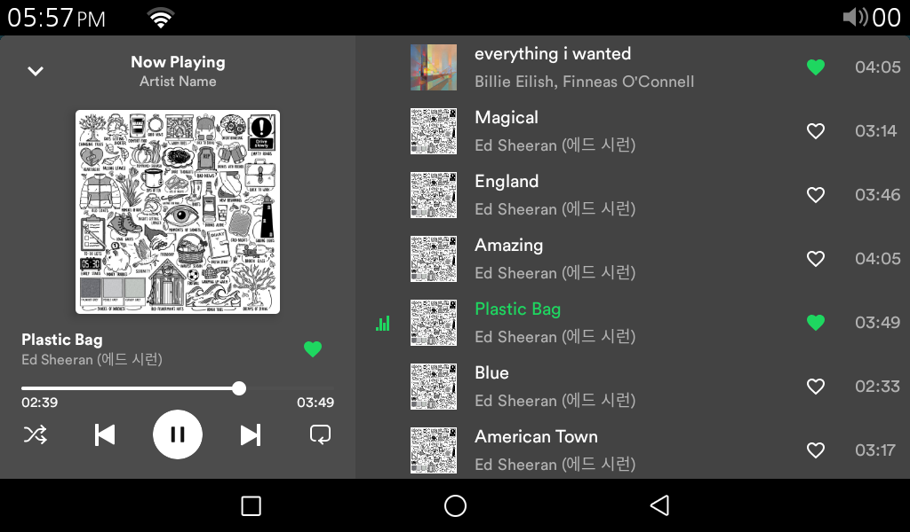
